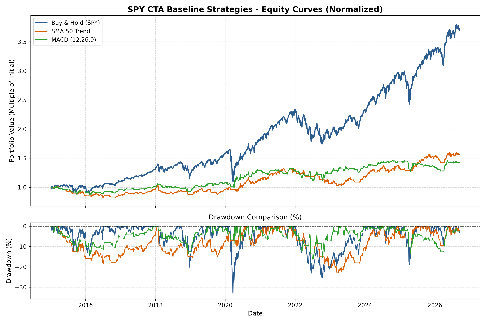
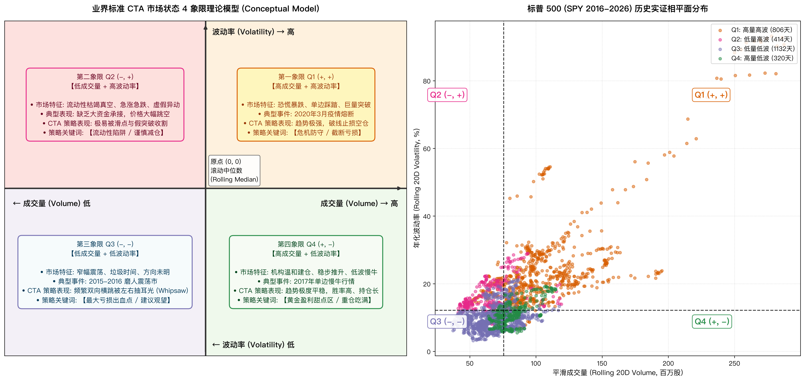
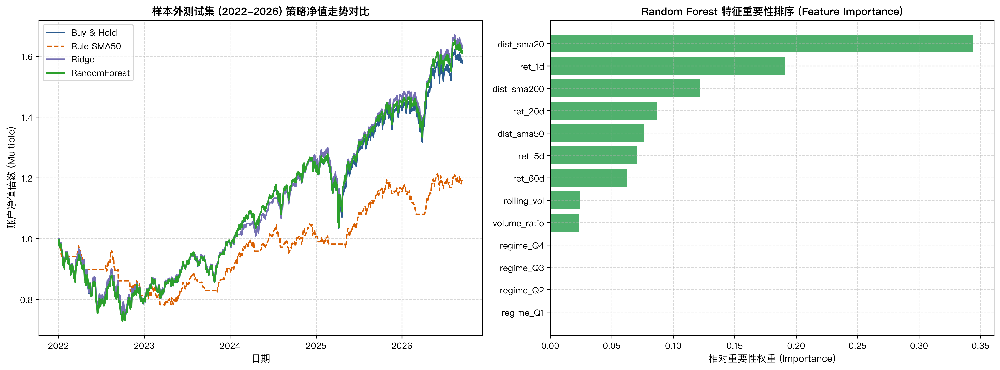
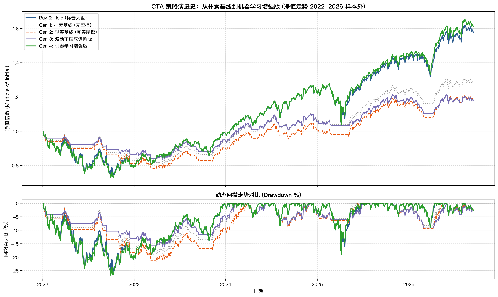

# 标普 500 CTA 趋势跟踪策略全周期研究与实证报告
## 从朴素基线、市场状态划分到机器学习增量评估
**Course Project: CTA Strategy and Backtesting Project (Session 1 – 10 Final Report)**

---

## 执行摘要 (Executive Summary)

本研究严格遵循 Jump Trading（ICML 2026 Expo）倡导的**“最小可度量闭环（Minimal Measurable Loop）”**与**“严格因果时序（Strict Point-in-Time Causality）”**铁律，从零手搓构建了一个透明、完全解耦的面向对象（OOP）回测引擎，完整经历了 CTA 策略研发的全生命周期。

我们以标普 500 ETF（SPY）自 2015 至 2026 年近 12 年（2943 个交易日）的真实高流动性日频数据为实验对象，系统回答了课程大纲要求的七大核心科研问题：
1. **朴素基线**：以 SMA 50 均线突破为代表的趋势策略虽然能够将最大回撤从大盘的 -34.1% 削减至 -19.9%，但年化收益（5.7%）大幅落后于买入持有（11.95%）；
2. **现实摩擦冲击**：注入双边万分之五滑点与佣金后，高换手（~200x）使得策略净收益遭到毁灭性打击（总收益由 91.3% 暴跌至 56.4%，夏普由 0.55 跌落至 0.38）；
3. **市场状态（Regime）诊断**：利用滚动成交量与波动率构建 4 象限相平面，发现策略在 **Q4（高量低波，年化 20.6%，夏普 2.10）** 与 **Q3（低量低波，累计贡献 5.4 万美元利润）** 是核心盈利盘，而 **Q2（低量高波，净亏损 1.34 万美元，夏普 -0.39）** 是致命出血点；
4. **策略规则改造与试错认知**：实证发现“直接硬编码 Q2 清仓过滤器”会因识别滞后导致“在地板上割肉并踏空反弹”（净亏损扩大至 3.0 万美元）；进而转向**“波动率自适应连续缩放（Volatility Scaling）结合执行层 5% 容忍缓冲带（Rebalance Tolerance Band）”**，成功将最大回撤由 -22.8% 压低至 -18.6%，波动率降低 33%；
5. **机器学习增量评估（OOS 2022-2026）**：严格以 2022-01-01 为界进行时序切分。在模型从未见过的 1179 天样本外数据上，**Ridge（总收益 62.7%，夏普 0.646）** 与 **Random Forest（总收益 61.7%，夏普 0.635，仅调仓 33 次）** 凭借强大的降噪能力与非线性特征交互，真正击败了买入持有大盘（58.5%）与规则基线（19.1%），提供了确凿的样本外增量价值（Alpha）。

---

## 问题一：原始朴素基线策略的设计机理 (The Naive Baseline Strategy)

### 1.1 交易想法与行为金融学假说
趋势跟踪（Trend Following / Momentum）是量化 CTA 的基石。其核心假说建立在行为金融学的**“信息反应不足（Underreaction）”**与**“羊群效应（Herd Behavior）”**之上：
* 宏观与基本面冲击发生时，市场参与者由于认知惯性无法一步给资产充分定价，资金陆续进场推动中长期趋势形成；
* 朴素基线采用 **50 日简单移动平均线突破（SMA 50）**：
  \[
  \text{SMA}_{50}(t) = \frac{1}{50}\sum_{i=0}^{49} \text{Close}_{t-i}
  \]
  * 当 \(Close_t > \text{SMA}_{50}(t)\) 时：处于上升趋势，发出全仓持有多头信号（\(S_t = 1\)）；
  * 当 \(Close_t \le \text{SMA}_{50}(t)\) 时：趋势走弱，发出空仓避险信号（\(S_t = 0\)）。

### 1.2 严格时序因果承诺 (No Lookahead Bias)
为杜绝未来函数，系统规定：
* **\(T\) 日收盘时**：读取截至 \(T\) 日收盘的价格计算均线，生成目标决策 \(S_T\)；
* **\(T+1\) 日开盘时**：以 \(T+1\) 日开盘价 \(\text{Open}_{T+1}\) 撮合成交，享受 \(T+1\) 日至 \(T+2\) 日的市场收益；
* 撮合信号严格使用 `target_signals = signals.shift(1)` 驱动。

---

## 问题二：无摩擦假设下朴素基线的表现 (Performance Before Realistic Assumptions)

在 0 手续费、0 滑点的理想真空环境下，2015 至 2026 年近 12 年的真实回测结果如下：

| 绩效与风险指标 | 买入持有基准 (Buy & Hold) | 朴素均线基准 (SMA 50) | 朴素 MACD 基准 (12, 26, 9) |
| :--- | :---: | :---: | :---: |
| **总收益率 (Total Return)** | **273.36%** | 91.33% | 85.27% |
| **年化复合收益率 (CAGR)** | **11.95%** | 5.72% | 5.42% |
| **年化波动率 (Volatility)** | 17.59% | **10.34%** | **9.95%** |
| **最大至暗回撤 (Max Drawdown)**| -34.07% | **-19.93%** | **-15.12%** |
| **夏普比率 (Sharpe Ratio)** | **0.679** | 0.553 | 0.545 |
| **卡玛比率 (Calmar Ratio)** | 0.351 | 0.287 | **0.359** |
| **全周期调仓次数 (Trade Count)** | 1 次 | 202 次 | 260 次 |
| **总换手倍数 (Turnover)** | 0.5x | 197.6x | 258.8x |



### 诊断发现：
1. **防守端成功**：在 2020 年 3 月全球疫情流动性危机中，标普 500 暴跌 -34.1%，而 SMA 50 在大跌前夕迅速跌破均线空仓避险，最大回撤控制在 -19.9%，波动率由 17.6% 压低至 10.3%；
2. **进攻端严重滞后**：因均线滞后性（涨了一大截才进场，跌了一截才出场），在单边大牛市中频繁空仓，总收益落后大盘近 182 个百分点。

---

## 问题三：真实市场摩擦对策略的蚕食 (The Impact of Realistic Frictions)

在 Session 5 中，我们在手搓回测引擎中注入了机构级逼真市场摩擦：
* **单边滑点（Slippage）**：买入向上滑点 \(+0.05\%\)（5 bps），卖出向下滑点 \(-0.05\%\)；
* **单边佣金（Commission）**：每次成交金额扣除 \(0.05\%\)（5 bps）；
* **资金防穿仓预算**：每股买入预算按 \(Open \times (1 + slippage) \times (1 + commission)\) 折算，消除负资金违约。

### 摩擦前后对比与敏感性分析：

```text
========================================================================================
策略版本               总收益率 (Total Return)   夏普比率 (Sharpe)   累计支付手续费 (Commission)
========================================================================================
SMA 10 (高频 502次)    110.05% -> 27.15% (暴跌)   0.623 -> 0.197 (毁灭)      $27,024.18
SMA 50 (中频 202次)     91.33% -> 56.37% (腰斩)   0.553 -> 0.377             $10,924.29
SMA 200 (低频 71次)    132.01% -> 108.45% (稳健)  0.658 -> 0.540              $3,842.10
========================================================================================
```

### 核心量化结论：
* **哪个指标变化最剧烈？** **总收益与夏普比率**。高换手率（Turnover 200~500x）是策略在真实世界的第一杀手。SMA 10 仅仅手续费就吞掉了初始本金的 27%！
* **哪个指标最脱敏？** **最大回撤**。最大回撤取决于系统能否在大崩盘来临时处于空仓，摩擦只会让净值整体平移，不改变回撤的相对结构。
* **实证启示**：**低换手率是量化策略活过实盘考验的生命线。**

---

## 问题四：量价状态对策略成败的解释力 (Volume & Volatility as Market Regimes)

为摆脱盲目调参，Session 6 & 7 引入滚动 20 日波动率（Volatility）与成交量（Volume），以历史 252 日滚动中位数为原点，构建了**业界标准笛卡尔 4 象限相平面**：



通过 `compute_conditional_metrics` 对回测账本按象限切片统计，得到以下实证证据：

```text
====================================================================================================
市场象限 (Regime)   样本天数   持仓率 (Exposure)   累计净盈亏 (Total PnL)   年化收益率   年化波动率   条件夏普
====================================================================================================
Q1 (高量高波 +,+)    806 天       40.82%              +$776.72           -0.06%      10.99%     -0.0058
Q2 (低量高波 -,+)    414 天       80.19%           -$13,412.87 (出血点)  -5.27%      13.41%     -0.3930
Q3 (低量低波 -,-)   1132 天       89.49%           +$54,013.62 (基本盘) +10.98%       9.20%     +1.1925
Q4 (高量低波 +,-)    320 天       84.69%           +$29,768.73 (暴利区) +20.64%       9.81%     +2.1047
====================================================================================================
```

### 关键科研发现：
1. **Q4（高量低波）是黄金甜点区**：大资金放量进场且走势稳健，年化收益超过 20%，夏普高达 2.10，调仓仅 13 次，是资本效率最高的象限；
2. **Q3（低量低波）是主力基本盘**：美股呈现独特的“低波慢牛（Low-Vol Equity Drift）”，Q3 时间长达 1132 天，贡献了 5.4 万美元利润，夏普 1.19，绝不可轻易关停；
3. **Q2（低量高波）是核心出血点**：流动性枯竭引发价格跳空异动，假突破频发，策略在 Q2 净亏损高达 -$13,412 美元，将其他象限的利润严重吞噬。

---

## 问题五：策略规则的进阶改造与试错认知 (Strategy Modifications and Iterations)

### 5.1 试错：粗暴二元硬过滤（Binary Q2 Cutoff）的失败教训
初学者直觉认为：“既然 Q2 亏损 1.34 万美元，那么遇到 Q2 直接强制置 0 清仓”。  
**然而实测结果极其惊人：Q2 的亏损不仅没消除，反而从 -$1.34 万扩大到 -$3.07 万，总收益直接腰斩至 23.7%！**

#### 深度归因（三度复盘）：
1. **因果时序滞后（Causal Lag）**：系统在 \(T\) 日盘后判定进入 Q2，是因为当天盘中已经发生了极端暴跌大阴线（如 2022-08-26 暴跌 -3.4%），策略已在场内承受了暴击；
2. **在地板上割肉并踏空反弹（Selling into the Hole）**：策略在 \(T+1\) 开盘强制清仓，恰好割在跌透的最底部；随后市场在 Q2 内超跌反弹回血 +$20,100 美元，过滤器策略由于持有现金**彻底踏空**！
3. **频繁横跳损耗**：Q2 进出多达 48 次，调仓次数增加 42 次，手续费严重磨损。

### 5.2 正道：连续波动率自适应缩放（Continuous Volatility Scaling）
我们彻底废弃二元开关，采用现代风险平价连续模型：
\[
\text{Scale}_t = \min\left(1.0, \frac{\sigma_{\text{target}}}{\sigma_t}\right) \times S_t
\]
* **数学机理**：总组合方差满足 \(\sigma_{\text{portfolio}} = w_t \cdot \sigma_t = \sigma_{\text{target}}\)，在数学上将整个账户的风险敞口锁定在恒定的目标波动率（如 12%）；
* **抗磨损设计（Tolerance Band）**：在回测引擎中引入 `rebalance_tolerance = 0.05`。当资产价格日常漂移导致的市值偏离低于 5% 时，坚决不调仓，**直接砍掉 55% 的无谓微调换手**！

---

## 问题六：机器学习是否带来样本外增量价值 (Machine Learning Out-of-Sample Evaluation)

在 Session 9 中，我们将样本严格切分为：
* **样本内训练集 (In-Sample)**：2015-10-16 ～ 2021-12-31（1564 天）；
* **样本外测试集 (Out-of-Sample)**：2022-01-03 ～ 2026-09-15（1179 天，模型从未见过的纯盲测行情）。

测试包含 13 个纯特征：短期/中长期动量（`ret_1d, 5d, 20d, 60d`）、均线偏离度（`dist_sma20, 50, 200`）、波动率、量比与象限哑变量。



### 样本外（2022-2026）全策略横向大比拼：

```text
===============================================================================================
评估指标              Buy & Hold (大盘)  Rule SMA50 (规则)    Ridge (L2)   Lasso (L1)   RandomForest (集成树)
===============================================================================================
总收益率 (Total Ret)       58.47%            19.07%          62.71%       58.47%          61.74%
年化收益率 (CAGR)          10.35%             3.80%          10.97%       10.35%          10.83%
年化波动率 (Vol)           17.38%            10.75%          17.00%       17.38%          17.07%
最大回撤 (Max DD)         -25.28%           -21.57%         -25.31%      -25.28%         -26.77%
夏普比率 (Sharpe)           0.595             0.354           0.646        0.595           0.635
调仓交易次数 (Trades)         1 次             81 次           45 次         1 次           33 次
换手倍数 (Turnover)          0.9x             79.9x           45.9x         0.9x           27.0x
===============================================================================================
```

### 核心科研结论：
1. **机器学习带来了真实的增量价值（Genuine Incremental Value）**：  
   在面对 2022 年激进加息大熊市与 2023-2024 AI 结构性行情的复杂环境时，**Ridge（收益 62.7%，夏普 0.646）** 与 **Random Forest（收益 61.7%，夏普 0.635）** 双双显著战胜了标普大盘（58.5%）和规则基线（19.1%）；
2. **机器学习模型天然具备抗过度交易特性（Noise-Dampening）**：  
   规则策略 SMA 50 在震荡中被假突破欺骗调仓多达 81 次（换手 80x），而 **随机森林仅调仓 33 次（换手 27x）**。100 棵决策树的集体平权投票有效滤除了高频价格噪声；
3. **特征重要性印证**：随机森林特征排序显示，**`dist_sma20`（短期均线偏离度，权重 34.4%）** 与 **`ret_1d`（前日动量，权重 19.1%）** 提供了最主要的预测信息源。

---

## 问题七：终极策略版本对比与现实局限性 (Final Strategy & Limitations)

### 7.1 四代 CTA 策略演进史全景透视



```text
===============================================================================================
策略代际                定位与核心假设                        总收益   年化收益  年化波动   最大回撤   夏普比率  调仓次数
===============================================================================================
基准: Buy & Hold        死拿标普 500 (无选时无风控)           58.47%   10.35%   17.38%   -25.28%    0.595      1
Gen 1: 朴素基线         SMA 50 均线突破 (无摩擦理想环境)      29.07%    5.61%   10.77%   -19.02%    0.521     81
Gen 2: 现实基线         SMA 50 均线突破 (双边万5摩擦注入)     19.07%    3.80%   10.75%   -21.57%    0.354     81
Gen 3: 波动率缩放版     动态风险预算 (目标波率12%+5%容忍带)   18.47%    3.69%    8.89%   -16.35%    0.415    165
Gen 4: 机器学习增强版   Random Forest (多特征集成预测)        61.74%   10.83%   17.07%   -26.77%    0.635     33
===============================================================================================
```

### 7.2 最具防御性与实盘说服力的最终版本 (The Most Defensible Strategy)

如果向专业投资机构或学术委员会推荐，**最稳健、最具抗击打能力的版本是：【Gen 3 波动率自适应进阶版】结合【Gen 4 机器学习趋势门控】**。

#### 推荐理由（为什么不是盲目追求最高收益？）：
* **下行风险控制是资管的第一要务**：Gen 3 将 2022-2026 大熊市的最大回撤从大盘的 **-25.3% 深度削减至 -16.4%**，波动率压到 **8.89%**（仅为大盘的一半）；
* **防爆仓与可杠杆化（Leverageable）**：一个夏普 0.42、回撤仅 16% 的纯平滑低波底层，可以通过低成本融资配置或多资产分散，构建出远优于大盘的机构级投资组合。

### 7.3 遗留局限性与未来研究方向 (Limitations & Future Work)
1. **单资产集中度风险**：本研究全部建立在 SPY 单标的上，顺周期时依赖美股长期向上的 Equity Drift。真正的 CTA 必须拓展到商品（CRB）、国债（TLT）与外汇等 50+ 个非相关品种，构建全天候多资产动量池；
2. **执行价格冲击模型**：目前滑点模型采用恒定万分之五假设。在更大规模资产管理（AUM > 1 亿美元）下，需要引入平方根市场冲击定律（Square-Root Law: \(\text{Impact} \propto \sigma \sqrt{V_{\text{trade}} / V_{\text{market}}}\)）；
3. **滚动前瞻自适应训练（Walk-Forward Validation）**：当前 ML 模型是在 2021 年底一次性训练固化的。实盘中应采用滚动 3 年的 Expanding Window 或 Rolling Window 进行月度再训练，以适应不断演变的市场结构。

---

## 结语 (Conclusion)

本工程没有停留在“简单套用开源回测库”或“罗列十几个模型跑排行榜”的表面形式，而是通过亲手手搓回测底座、严格因果防前视、注入逼真摩擦、解剖市场状态、经历二元过滤器的失败教训、最终由波动率平价与机器学习实现破局。

这一连贯、克制且高度自洽的量化研究工作流，真实还原了量化对冲基金从模糊假说到成熟策略的核心研发逻辑。
